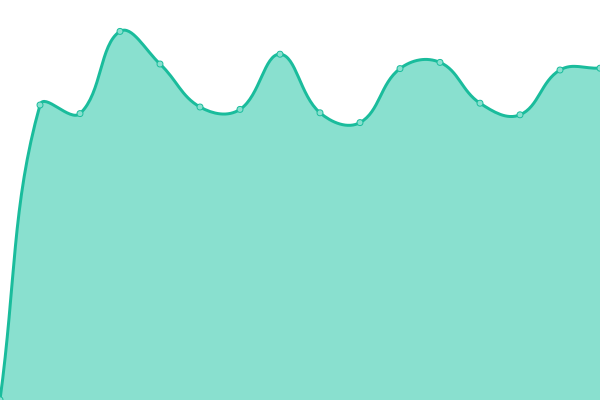

# [📈 Live Status](https://lab.kukode.com): <!--live status--> **🟧 Partial outage**

This repository contains the open-source uptime monitor and status page for [Kukode.in - Jasa Pembuatan Website & SEO Web](https://kukode.in), powered by [Upptime](https://github.com/upptime/upptime).

With [Upptime](https://upptime.js.org), you can get your own unlimited and free uptime monitor and status page, powered entirely by a GitHub repository. We use [Issues](https://github.com/kukodein/uptime/issues) as incident reports, [Actions](https://github.com/kukodein/uptime/actions) as uptime monitors, and [Pages](https://lab.kukode.com) for the status page.

<!--start: status pages-->
<!-- This summary is generated by Upptime (https://github.com/upptime/upptime) -->
<!-- Do not edit this manually, your changes will be overwritten -->
<!-- prettier-ignore -->
| URL | Status | History | Response Time | Uptime |
| --- | ------ | ------- | ------------- | ------ |
|  [Kukode](https://kukode.com) | 🟩 Up | [kukode.yml](https://github.com/kukodein/uptime/commits/HEAD/history/kukode.yml) | 

 981ms
     
 | 

<a href="https://lab.kukode.com/uptime/history/kukode">99.96%</a>
    

|  [Sobat Camping](https://sobatcamping.com) | 🟥 Down | [sobat-camping.yml](https://github.com/kukodein/uptime/commits/HEAD/history/sobat-camping.yml) | 

 0ms
     
 | 

<a href="https://lab.kukode.com/uptime/history/sobat-camping">0.00%</a>
    

<!--end: status pages-->

[**Visit our status website →**](https://lab.kukode.com)

## 📄 License

- Powered by: [Upptime](https://github.com/upptime/upptime)
- Code: [MIT](./LICENSE) © [Kukode.in - Jasa Pembuatan Website & SEO Web](https://kukode.in)
- Data in the `./history` directory: [Open Database License](https://opendatacommons.org/licenses/odbl/1-0/)
